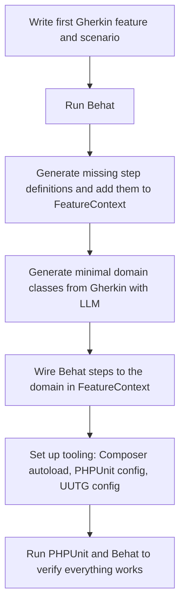
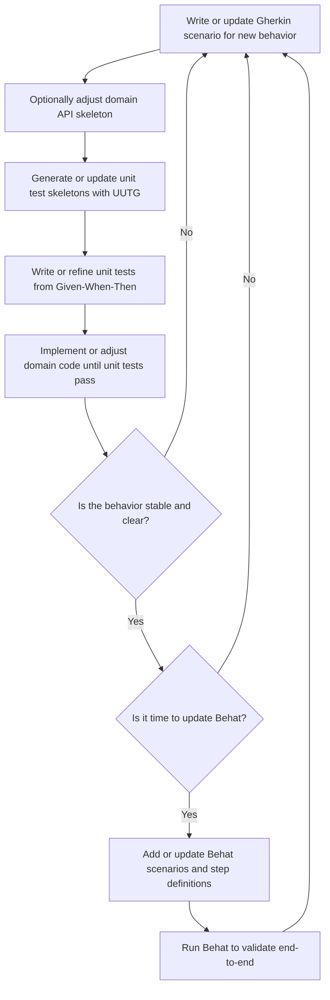

# CLAUDE.md - AI Assistant Guide

This document provides comprehensive guidance for AI assistants working on this codebase.

## Project Overview

This is a **BDD/TDD demonstration project** that combines:
- **Behavior Driven Development (BDD)** using Gherkin and Behat
- **Test Driven Development (TDD)** using PHPUnit
- **LLM-driven development** for translating business specs into code

### Technology Stack

- **PHP 8.4** (strict types enabled throughout)
- **Behat 3.27+** - BDD framework for Gherkin scenarios
- **PHPUnit 12.4+** - Unit testing framework
- **UUTG 2.0+** - Unit test skeleton generator
- **Laravel components** (routing, HTTP, container, events) - Lightweight HTTP layer
- **Composer** - Dependency management

## Repository Structure

```
/
├── features/                    # Gherkin feature files
│   ├── bootstrap/
│   │   └── FeatureContext.php  # Behat step definitions
│   └── *.feature               # Business behavior specifications
├── src/
│   └── Domain/                 # Domain model (pure business logic)
│       └── Cart.php            # Example: Cart domain class
├── app/
│   └── Http/
│       └── Controllers/        # HTTP API controllers
│           └── CartController.php
├── tests/
│   └── Domain/                 # Unit tests (mirror src/Domain)
│       └── CartTest.php
├── public/
│   └── index.php              # HTTP entry point
├── behat.yml                  # Behat configuration
├── phpunit.xml.dist           # PHPUnit configuration
├── uutg.php                   # UUTG configuration
├── composer.json              # Dependencies and autoload config
└── translate-gherkin-spec-into-unit-tests.md  # Workflow documentation
```

### Directory Conventions

1. **Domain logic** (`src/Domain/`): Pure business logic, framework-agnostic
2. **Application layer** (`app/Http/`): HTTP-specific adapters, controllers
3. **Tests** (`tests/`): Mirror the `src/` structure
4. **Features** (`features/`): Gherkin specifications and Behat contexts

## Development Workflows

### Bootstrap Workflow (New Feature/Project)

Use this when starting a new feature from scratch:



**Key Steps:**

1. **Write Gherkin scenario** in `features/*.feature`
2. **Run Behat** to generate step definition templates
3. **Create domain classes** (manually or with LLM assistance)
4. **Implement step definitions** in `features/bootstrap/FeatureContext.php`
5. **Configure tooling** (composer.json autoload, phpunit.xml.dist, uutg.php)
6. **Verify** with `vendor/bin/behat` and `vendor/bin/phpunit`

### Iteration Workflow (Evolving Features)

Use this for iterative development on existing features:



**Key Principles:**

- Work at the **unit test level** for rapid TDD cycles
- Update **Behat scenarios** when behavior stabilizes
- Use **UUTG** to scaffold test methods from domain classes
- Keep **Given/When/Then** aligned with **Arrange/Act/Assert**

## Critical Conventions

### 1. PHP Code Standards

```php
<?php declare(strict_types=1);  // ALWAYS at the top of every PHP file

namespace App\Domain;  // PSR-4 autoloading

final class Cart  // Prefer final classes for domain models
{
    private int $total = 0;  // Strong typing

    public function addItem(int $priceInEuros): void  // Type all parameters and returns
    {
        if ($priceInEuros < 0) {  // Domain validation
            throw new \InvalidArgumentException('Price must be positive');
        }

        $this->total += $priceInEuros;
    }
}
```

**Rules:**
- `declare(strict_types=1)` on every file
- Type everything: parameters, return types, properties
- Use `final` for domain classes to prevent inheritance
- Validate at domain boundaries, throw `InvalidArgumentException` for invalid input

### 2. Gherkin Structure

**File:** `features/*.feature`

```gherkin
Feature: Cart total calculation

  Scenario: Adding a single item updates the cart total
    Given an empty cart
    When I add an item priced at 10€
    Then the cart total should be 10€
    And the cart should contain 1 item
```

**Rules:**
- One Feature per file
- Scenarios describe business behavior, not implementation
- Use business language (e.g., "10€" not "price=10")
- Keep scenarios focused (one primary behavior per scenario)

### 3. Behat Step Definitions

**File:** `features/bootstrap/FeatureContext.php`

```php
#[Given('an empty cart')]
public function anEmptyCart(): void
{
    $this->cart = new Cart();
    $this->lastErrorMessage = null;
}

#[When('I add an item priced at :price€')]
public function iAddAnItemPricedAt(int $price): void
{
    $this->cart->addItem($price);
}

#[Then('the cart total should be :total€')]
public function theCartTotalShouldBe(int $total): void
{
    Assert::assertSame($total, $this->cart->total());
}
```

**Rules:**
- Use PHP 8 attributes (`#[Given]`, `#[When]`, `#[Then]`)
- Parameter placeholders use `:name` syntax
- Store domain objects as private properties
- Use `PHPUnit\Framework\Assert` for assertions
- Handle exceptions with try/catch for "I try to..." steps

### 4. Unit Tests

**File:** `tests/Domain/CartTest.php`

```php
#[Test]
public function testAddItem(): void
{
    // Given an empty cart (setUp)

    // When I add an item priced at 10€
    $this->cart->addItem(10);

    // Then the cart total should be 10€
    self::assertSame(10, $this->cart->total());
}
```

**Rules:**
- Use `#[Test]` attribute (not `test` prefix)
- Include Given/When/Then comments to show Gherkin mapping
- Use `self::assertSame()` for strict equality
- One assertion focus per test (single responsibility)
- Test method names describe the behavior: `testAddMultipleItemsCumulatively`

### 5. Given/When/Then → Arrange/Act/Assert Mapping

This is the **core pattern** of this project:

| Gherkin | Unit Test | Purpose |
|---------|-----------|---------|
| **Given** | **Arrange** | Set up initial state |
| **When** | **Act** | Perform the action |
| **Then** | **Assert** | Verify the outcome |

**Example Translation:**

```gherkin
Scenario: Adding multiple items updates the cart total cumulatively
  Given an empty cart
  When I add an item priced at 10€
  And I add an item priced at 20€
  Then the cart total should be 30€
```

↓

```php
#[Test]
public function testAddMultipleItemsCumulatively(): void
{
    // Arrange (Given an empty cart)
    $cart = new Cart();

    // Act (When I add items)
    $cart->addItem(10);
    $cart->addItem(20);

    // Assert (Then the total should be 30€)
    self::assertSame(30, $cart->total());
}
```

See `translate-gherkin-spec-into-unit-tests.md` for detailed explanation.

## Tools and Commands

### Running Tests

```bash
# Run Behat scenarios
vendor/bin/behat

# Run specific feature
vendor/bin/behat features/cart_total.feature

# Run PHPUnit tests
vendor/bin/phpunit

# Run specific test file
vendor/bin/phpunit tests/Domain/CartTest.php
```

### Generating Test Skeletons

```bash
# Generate unit test skeleton for a domain class
vendor/bin/uutg --class="App\Domain\Cart" --config="uutg.php" > tests/Domain/CartTest.php
```

**UUTG Configuration** (`uutg.php`):
- Uses `vendor/umc/uutg/uutg.php.dist` as base
- Override `namespace_strategy` to control test namespace
- Set `test_method_prefix` and `use_test_attribute`

### Composer

```bash
# Install dependencies
composer install

# Add dev dependency
composer require --dev package/name

# Update autoload
composer dump-autoload
```

## AI Assistant Guidelines

### When Adding New Features

1. **Start with Gherkin**: Write the business scenario first
2. **Run Behat**: Let it generate step definition templates
3. **Create domain classes**: Keep them in `src/Domain/`, pure business logic
4. **Translate to unit tests**: Use Given/When/Then → Arrange/Act/Assert
5. **Implement with TDD**: Red → Green → Refactor
6. **Wire Behat steps**: Connect step definitions to domain objects
7. **Verify end-to-end**: Run both Behat and PHPUnit

### When Modifying Existing Code

1. **Read the Gherkin scenarios first**: Understand business intent
2. **Check existing tests**: See how behavior is currently tested
3. **Update Gherkin if needed**: If requirements change
4. **Update unit tests**: Keep Given/When/Then alignment
5. **Modify domain code**: Maintain strict typing and validation
6. **Update Behat steps**: If scenario steps changed
7. **Run all tests**: `vendor/bin/phpunit && vendor/bin/behat`

### Code Quality Standards

- **Never remove `declare(strict_types=1)`**
- **Always type-hint parameters and return types**
- **Use `final` for domain classes** unless inheritance is explicitly needed
- **Validate input at domain boundaries** - throw `InvalidArgumentException`
- **Keep domain logic pure** - no framework dependencies in `src/Domain/`
- **Mirror test structure** - `tests/Domain/` matches `src/Domain/`

### Common Pitfalls to Avoid

❌ **Don't**: Mix business logic into controllers
✅ **Do**: Keep controllers thin, delegate to domain classes

❌ **Don't**: Skip Gherkin → unit test translation
✅ **Do**: Maintain clear Given/When/Then → Arrange/Act/Assert mapping

❌ **Don't**: Generate UUTG skeletons over existing tests without reviewing
✅ **Do**: Use UUTG as a starting point, then refine

❌ **Don't**: Use weak typing or skip type declarations
✅ **Do**: Leverage PHP 8.4's strong typing fully

## HTTP API Layer

The project includes a minimal HTTP API using Laravel components:

**Entry Point:** `public/index.php`
- Routes defined inline using `Illuminate\Routing\Router`
- Session-based cart storage (for demo purposes)

**Controller:** `app/Http/Controllers/CartController.php`
- Thin adapter layer over domain logic
- JSON input/output
- Error handling returns appropriate HTTP status codes

**Routes:**
- `GET /cart` - Show cart state
- `POST /cart/items` - Add item (expects JSON: `{"price": 10}`)
- `DELETE /cart` - Clear cart

## File References

- Workflow diagrams: `README.md:14-47`
- Gherkin examples: `features/cart_total.feature`
- Domain model: `src/Domain/Cart.php`
- Unit tests: `tests/Domain/CartTest.php`
- Behat steps: `features/bootstrap/FeatureContext.php`
- GWT→AAA mapping: `translate-gherkin-spec-into-unit-tests.md`

## Additional Resources

- Behat documentation: https://docs.behat.org/en/latest/
- UUTG repository: https://github.com/UltimateModuleCreator/uutg
- PHPUnit documentation: https://phpunit.de/documentation.html

---

**Last Updated:** 2025-12-09
**Project Status:** Active development - Cart feature complete with BDD/TDD workflow established
