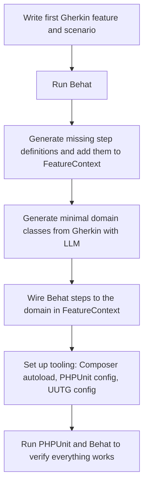
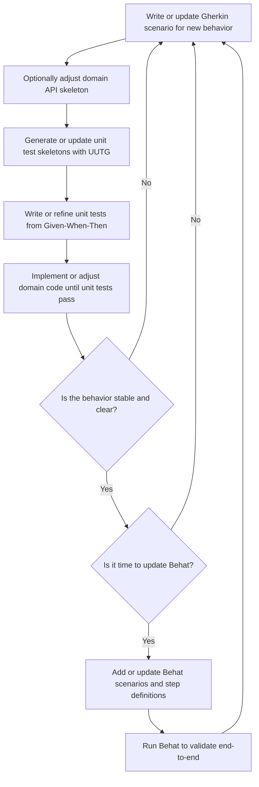

# bdd-php-gherkin-test

## Purpose

This project aims to demonstrate a concrete way to combine LLM-driven development, BDD (Behavior Driven Development) and TDD (Test Driven Development).

## Stack

PHP 8.4, PHPUnit, Next.js, Behat, UUTG

* Check Behat website : https://docs.behat.org/en/latest/
* Check UUTG : https://github.com/UltimateModuleCreator/uutg

## Bootstrap workflow



## Iterating workflow



## Bootstrap workflow - Text Snippet

```
# Every path given from project root.
# Lines beginning with $ are shell commands

# Initial Gherkin spec (eg : features/cart.feature)
$ cat << 'EOF' > features/cart.feature
Feature: Cart total calculation

  Scenario: Adding a single item updates the cart total
    Given an empty cart
    When I add an item priced at 10€
    Then the cart total should be 10€
    And the cart should contain 1 item
    And the cart items should be [10]
EOF

# Install Behat with composer
$ composer require --dev behat/behat

# Configure Behat properly in behat.yml (tested on 3.xx)
$ cat << 'EOF' > behat.yml
default:
  suites:
    default:
      paths:
        - features
      contexts:
        - FeatureContext
EOF

# Now running Behat will create file class features/bootstrap/FeatureContext.php
$ vendor/bin/behat

# At this point, create minimal domain classe(s) manually or via LLM, with Gherkin as an input.
$ cat << 'EOF' > src/Domain/Cart.php
<?php

...

final class Cart
{
    private int $total = 0;
    private int $itemsCount = 0;
    ...

    public function addItem(int $priceInEuros, int $quantity = 1): void
    {
    }

	...
}
EOF

# Edit FeatureContext class to match the domain. Example :

class FeatureContext implements Context
{
    ...

    #[Given('an empty cart')]
    public function anEmptyCart(): void
    {
        $this->cart = new Cart();
        $this->lastErrorMessage = null;
    }

    #[When('I add an item priced at :price€')]
    public function iAddAnItemPricedAt(int $price): void
    {
        $this->cart->addItem($price);
    }

    #[Then('the cart total should be :total€')]
    public function theCartTotalShouldBe(int $total): void
    {
        Assert::assertSame($total, $this->cart->total());
    }
}

# Install UUTG, a Unit Test Skeleton generator for PHP
$ composer require umc/uutg

# Make sure your autoload configuration is correct and that directories where you generate code exist
$ vendor/bin/uutg --class="App\Domain\Cart" --config="uutg.php" > tests/Domain/CartTest.php

# Install and configure PHPUnit
$ composer require --dev phpunit/phpunit

# Create phpunit config file at root if not present
$ cat << 'EOF' > phpunit.xml.dist
<?xml version="1.0" encoding="UTF-8"?>
<phpunit bootstrap="vendor/autoload.php"
         colors="true">
    <testsuites>
        <testsuite name="Unit">
            <directory>tests</directory>
        </testsuite>
    </testsuites>
</phpunit>
EOF

# Run unit tests and Behat again
$ vendor/bin/phpunit
$ vendor/bin/behat

# Then we are good to go to add new features in Gherkin and move on to the Iteration workflow
```

## Behavior milestone
