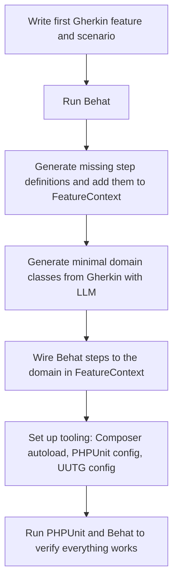
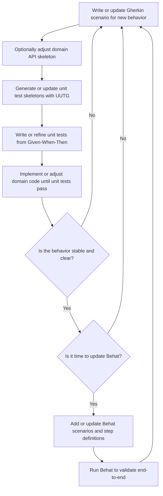

# bdd-php-gherkin-test

## Purpose

This project aims to demonstrate a concrete way to combine LLM-driven development, BDD (Behavior Driven Development) and TDD (Test Driven Development).

## Stack

PHP 8.4, PHPUnit, Next.js, Behat, UUTG

* Check Behat website : https://docs.behat.org/en/latest/
* Check UUTG : https://github.com/UltimateModuleCreator/uutg

## Bootstrap workflow

## Iterating workflow

## Behavior milestone